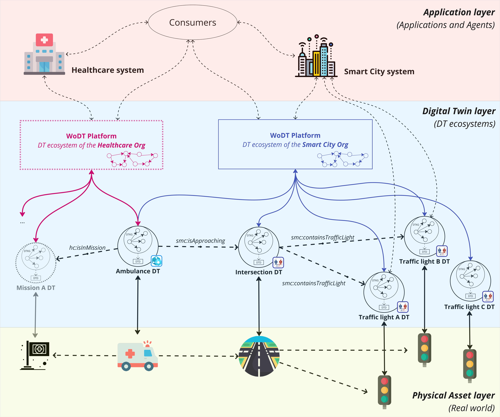

# Use case - Bootstrap

[](https://www.apache.org/licenses/LICENSE-2.0)

The bootstrap of the usecase that allows to deploy the WoDT Platform and the involved HWoDT-compliant Digital Twins. The scenario is about controlling traffic lights in a city to create a "green-route" for the ambulance.


<sub><sup>_images from [https://www.flaticon.com/](https://www.flaticon.com/)_<sub><sup>


## Prerequisites
- Make sure you have a running and active version of *Docker* and *docker compose*.

## Usage
1. Clone the repo
2. Create a `.env` file in the root directory with the following variables:
    - `PLATFORM_EXPOSED_PORT`: the port where the Smartcity WoDT Digital Twins Platform expose its services
    - `AMBULANCE_SIGNALR_NEGOTIATION_URL`: Azure SignalR Negotiation url for the Ambulance Digital Twin
    - `AMBULANCE_SIGNALR_TOPIC_NAME`:  the topic name used to publish events on SignalR for the Ambulance Digital Twin
    - `AMBULANCE_DIGITAL_TWIN_URI`: the uri of the exposed WoDT Digital Twin for the Ambulance Digital Twin
    - `AMBULANCE_EXPOSED_PORT`: the port where the Ambulance Digital Twin expose its services
    - `AMBULANCE_AZURE_CLIENT_ID`: ID of the Azure AD application for the Ambulance Digital Twin
    - `AMBULANCE_AZURE_TENANT_ID`: ID of the application's Azure AD tenant for the Ambulance Digital Twin
    - `AMBULANCE_AZURE_CLIENT_SECRET`: the Azure application's client secret for the Ambulance Digital Twin
    - `AMBULANCE_AZURE_DT_ENDPOINT`: the Azure Digital Twins instance endpoint for the Ambulance Digital Twin
    - `AMBULANCE_AZURE_DT_ID`: the id of the Digital Twin on Azure Digital Twins for the Ambulance Digital Twin
    - `AMBULANCE_PHYSICAL_ASSET_ID`: the Id of the Physical Asset for the Ambulance Digital Twin
    - `TRAFFIC_LIGHT_A_EXPOSED_PORT`: the port where the Traffic Light A Digital Twin expose its services
    - `TRAFFIC_LIGHT_A_PHYSICAL_ASSET_ID`: the Physical Asset Identifier for the Traffic Light A Digital Twin
    - `TRAFFIC_LIGH_A_PLATFORM_URL`: the url of the WoDT Digital Twins Platform to register for the Traffic Light A Digital Twin
    - `TRAFFIC_LIGHT_B_EXPOSED_PORT`: the port where the Traffic Light B Digital Twin expose its services
    - `TRAFFIC_LIGHT_B_PHYSICAL_ASSET_ID`: the Physical Asset Identifier for the Traffic Light B Digital Twin
    - `TRAFFIC_LIGH_B_PLATFORM_URL`: the url of the WoDT Digital Twins Platform to register for the Traffic Light B Digital Twin
    - `TRAFFIC_LIGHT_C_EXPOSED_PORT`: the port where the Traffic Light C Digital Twin expose its services
    - `TRAFFIC_LIGHT_C_PHYSICAL_ASSET_ID`: the Physical Asset Identifier for the Traffic Light C Digital Twin
    - `TRAFFIC_LIGHT_C_PLATFORM_URL`: the url of the WoDT Digital Twins Platform to register for the Traffic Light C Digital Twin
    - `INTERSECTION_EXPOSED_PORT`: the port where the Intersection Digital Twin expose its services
    - `TRAFFIC_LIGHT_A_URI`: the URI of the Traffic Light A Digital Twin
    - `TRAFFIC_LIGHT_B_URI`: the URI of the Traffic Light B Digital Twin
    - `INTERSECTION_PLATFORM_URL`: the url of the WoDT Digital Twins Platform to register for the Intersection Digital Twin
    - `GITHUB_PACKAGES_USERNAME`: GitHub Packages Username
    - `GITHUB_PACKAGES_PASSWORD`: GitHub Packages Password
3. Run the following command:
   ```bash
   docker-compose up -d
   ```

### A possible journey
1. Start observing the Platform KG of the Smart City WoDT Platform;
2. Retrieve the ambulance DT DTD;
3. Add the ambulance DT to the Platform to include it in the Smart City DT ecosystem;
4. Create the relationship between the ambulance DT and the intersection DT (to simulate an ambulance approaching an intersection) -- how relationships are managed in Azure-based DT is described in the ambulance DT [repository](https://github.com/WebBased-WoDT/adt-ambulance-dt?tab=readme-ov-file#usage-notes);
   - now you should notice an update in the Platform KG
5. Perform the following SPARQL query on the Smart City Platform to understand which traffic lights are interested and their available actions;
   ```sparql
        PREFIX smc: <https://smartcityontology.com/ontology#>
        PREFIX wodt: <https://purl.org/wodt/>
        
        SELECT ?trafficLight ?availableAction
        WHERE {
            <ambulance cached uri> smc:isApproaching ?intersection .
            ?intersection smc:containsTrafficLight ?trafficLight .
            ?trafficLight wodt:availableActionId ?availableAction .
        }
   ```
6. Obtain the DTD of the involved traffic lights to understand how to invoke actions;
7. Invoke the preferred and available action based on your logic.
